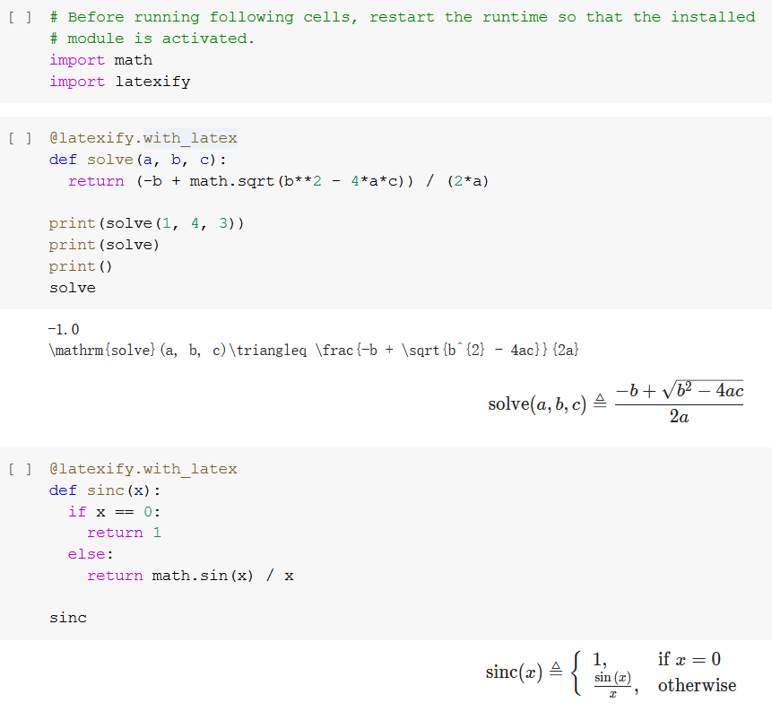
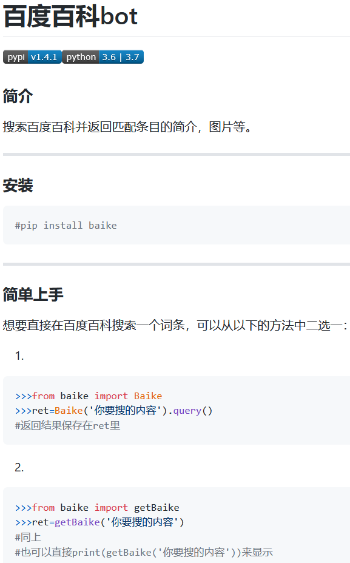
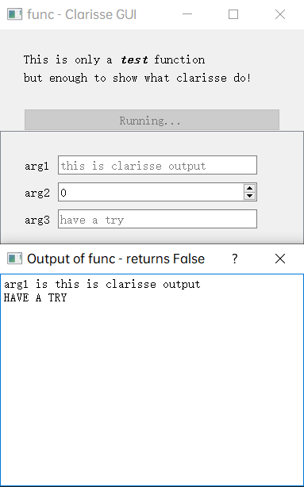

### Hi there 👋

The name is Yuan "Luke" Songwei, also known as "1MLightyears"(or Lightyears), a free, independent coder likes to write something fun! 
I can speak zh-cn, en, ja. 
Main developing language is Python & JavaScript, but I can also code in lua & C/++ & Java & Pascal. 
Now I'm interested in developing pipelines with Python, including ML/AI, data gathering/mining/analyzing, etc. 
I have experience of High Performance Computing(HPC) & Cluster File System & Distributed File System and experience of web development.
As a pre-OIer, I'm also interested in math and algorithms. 
- :open_file_folder: Some of my works: 
  1. (contributor) [pandas](https://github.com/pandas-dev/pandas)

      Exactly THAT `pandas` you know :smile:

      An error fixed by PR[#38919](https://github.com/pandas-dev/pandas/pull/38919).

  2. (contributor)[latexify_py](https://github.com/google/latexify_py) 1.7k:star:! 
      Convert Python functions to latex codes, connect math easily with codes, a wonderful tool to ML/AI developers to explicitly show their logic in papers. 
      Some logic codes was contributed.:blush: 
      
        

  3. (original)[baike](https://github.com/1Mlightyears/baike/) 
      A search-bot for [baidu baike](https://baike.baidu.com/) 
      Accurate info gathering, quick responding, various kinds of customization. 
      Uploaded to PyPI. Try `pip install baike`! 
      Widely commended by chatbots.:wink: 
        

  4. (original)<a href="https://github.com/1mlightyears/clarisse/">Clarisse</a> 
       A light-weighted, painless, quick-deploying Python program GUI framework. 
       Create a GUI for your Python with only one line! 
       No other modifications, simple custom switches, plenty guidance! 
       

  5. many other fun stuff! 
     check [Index.md](./Index.md) for them. 
- [My StackOverflow page](https://stackoverflow.com/users/14930120/lightyears) 
- 📫 How to reach me:  
  Send EMail to [1MLightyears@gmail.com](mailto://1MLightyears@gmail.com/)  
  or [lightyearsyuan@qq.com](mailto://lightyearsyuan@qq.com/)  
- 😄 Like my works? 
  Support me at [ko-fi](https://ko-fi.com/Lightyears/) for $  
  or [爱发电](https://www.afdian.net/@Lightyears/) for ￥ 
  or bitcoin, plz PM me 
  Thank you!:heart:
<!--
**1MLightyears/1MLightyears** is a ✨ _special_ ✨ repository because its `README.md` (this file) appears on your GitHub profile.

Here are some ideas to get you started:

- 🔭 I’m currently working on ...
- 🌱 I’m currently learning ...
- 👯 I’m looking to collaborate on ...
- 🤔 I’m looking for help with ...
- 💬 Ask me about ...
- 📫 How to reach me: ...
😄 Pronouns ...
- ⚡ Fun fact: ...
-->
